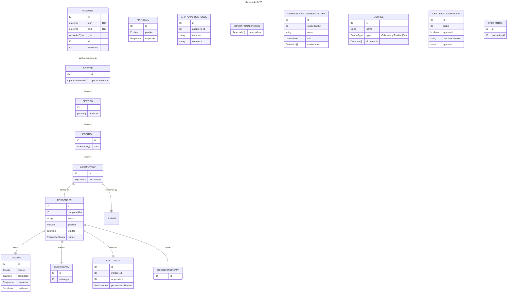

Notes:

1. credentials need to be audited separately from trainings
1. evaluations apply to command and general staff only
1. credentials are to evaluations what certificates are to trainings
1. operational periods are the columns in the roster

