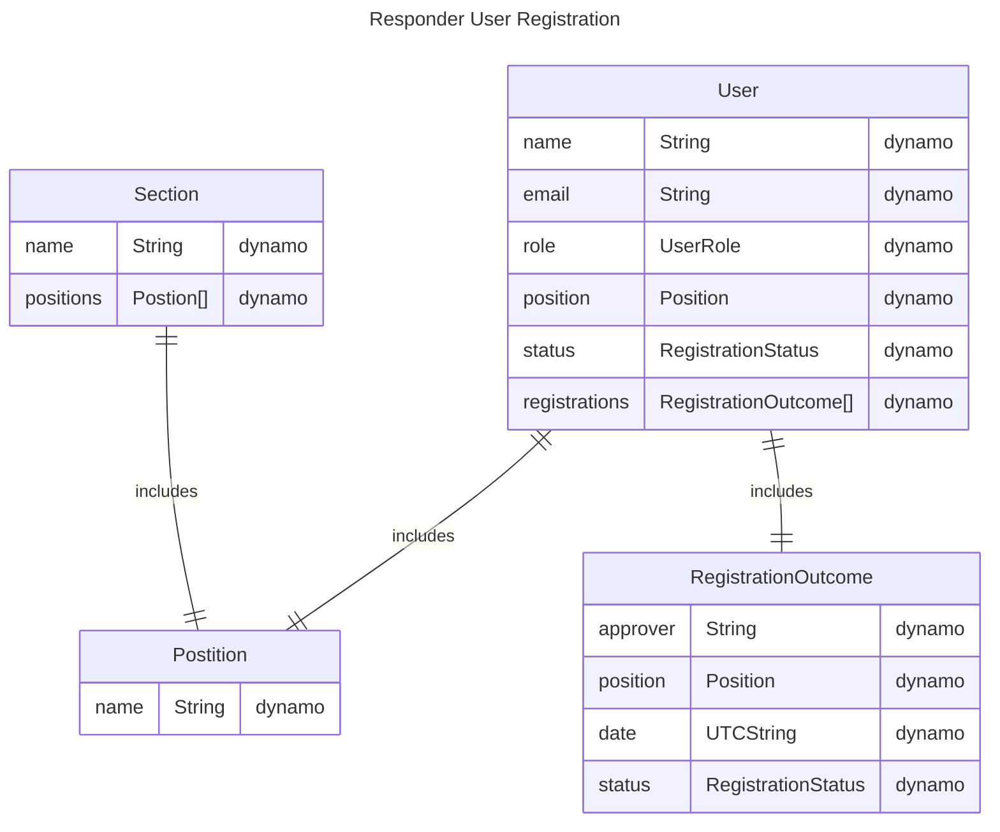

```mermaid
---
title: Responder User Registration
---
erDiagram
  Section  ||--|| Postition : includes
  User  ||--|| Postition : includes
  User  ||--|| RegistrationOutcome : includes

  Section {
    name String "dynamo"
    positions Postion[] "dynamo"
  }

  Postition {
    name String "dynamo"
  }

  User {
    name String   "dynamo"
    email String "dynamo"
    role UserRole "dynamo"
    position Position "dynamo"
    status RegistrationStatus "dynamo"
    registrations RegistrationOutcome[] "dynamo"
  }

  RegistrationOutcome {
    approver String  "dynamo"
    position Position "dynamo"
    date UTCString "dynamo"
    status RegistrationStatus  "dynamo"
  }

```
