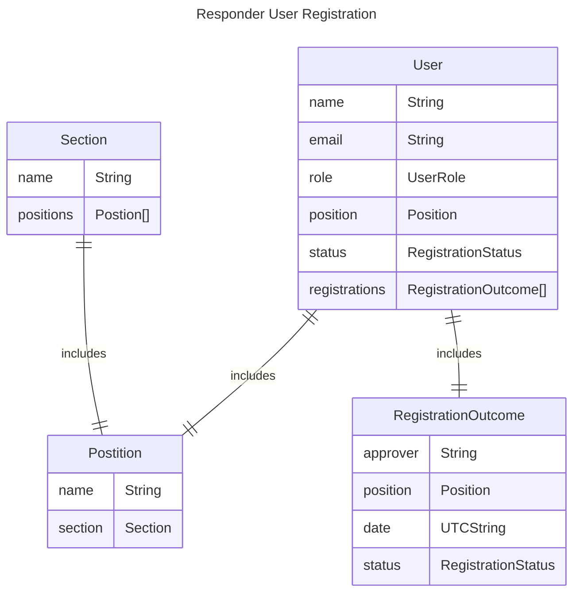

# Overview

An entity-relationship-diagram (ERD) representing the business objects used in responder user registration processes.

# ERD

# Appendix: Mermaid Sources

```mermaid
---
title: Responder User Registration
---
erDiagram
  Section  ||--|| Postition : includes
  User  ||--|| Postition : includes
  User  ||--|| RegistrationOutcome : includes

  Section {
    name String
    positions Postion[]
  }

  Postition {
    name String
    section Section
  }

  User {
    name String
    email String
    role UserRole
    position Position
    status RegistrationStatus
    registrations RegistrationOutcome[]
  }

  RegistrationOutcome {
    approver String
    position Position
    date UTCString
    status RegistrationStatus
  }
```
